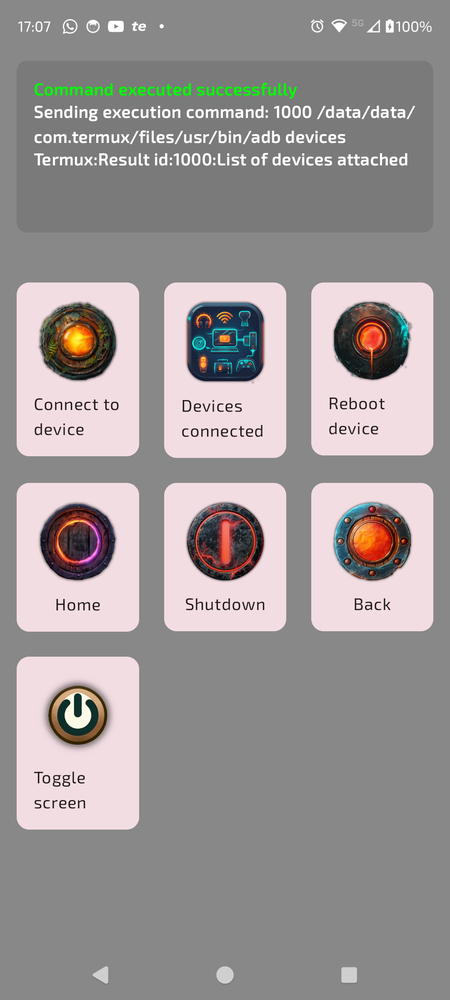

# android-remote-control

The Android Remote Controller is a versatile application designed to manage devices or services through ADB (Android Debug Bridge) commands. It offers a user-friendly interface to execute commands and receive instant feedback. This application is ideal for developers, system administrators, or tech enthusiasts who need to interact directly with their devices remotely.

## Features

- Command Execution: Execute ADB commands directly from your Android device.
- Live Feedback: Receive real-time output, errors, and success messages from executed commands.
- Customizable Command List: Easily add, modify, or remove commands from the grid layout.
- User-Friendly Interface: Intuitive interface with command buttons and a scrollable output area.

## Screenshots

[//]: # (mostriamo uno screenshot dell'applicazione che si trova nel root del progetto)

